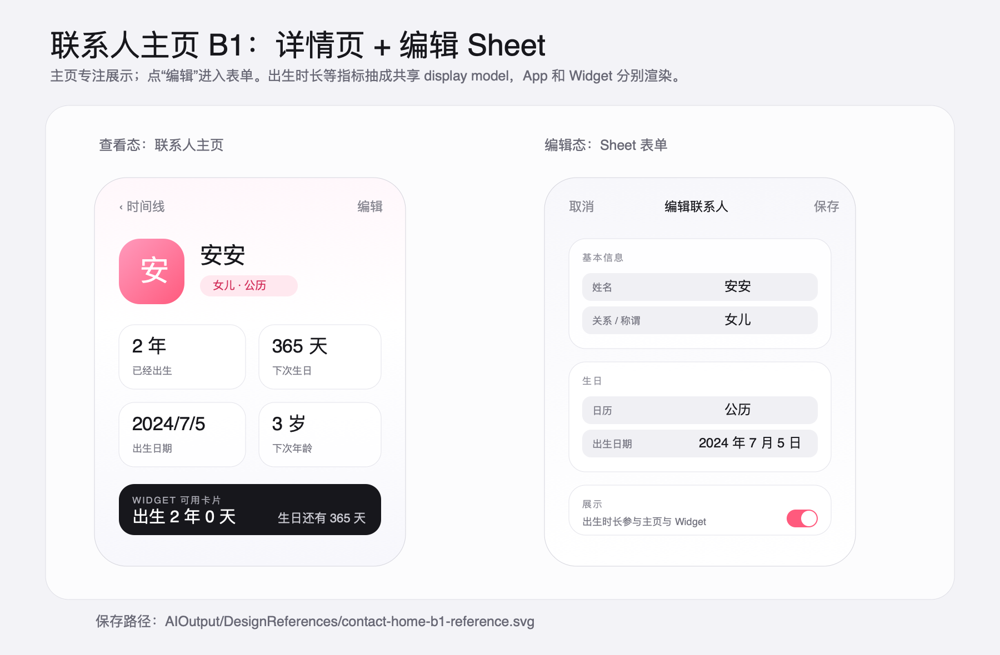

# 联系人主页与编辑设计

## 目标

为 BirthTracker 新增联系人主页，用于查看单个联系人的基本信息、生日摘要和备注，并提供明确的编辑入口。主页中的“已经出生多久”“下次生日倒计时”“下次年龄”等信息要能以同一套数据语义服务 App 页面和 Widget，避免 App UI 与 Widget UI 直接耦合。

参考图：

可编辑源图：`contact-home-b1-reference.svg`

## 已选方向

采用 B1：详情页 + 编辑 Sheet。

- 详情页专注展示：顶部是联系人身份信息，中部是生日指标卡片，底部是备注等低频信息。
- 编辑使用 Sheet：点详情页右上角“编辑”打开表单，用户通过“取消/保存”明确控制是否写入。
- 表单使用 draft state：打开时从 `TrackedPerson` 初始化，保存时一次性写回 SwiftData model。
- App 和 Widget 复用生日摘要 display model 的数据语义，不复用同一个完整 SwiftUI View。

## 交互架构

现有时间线列表中的联系人行改为进入联系人详情页。详情页读取传入的 `TrackedPerson`，展示姓名、关系或称谓信息、日历类型、生日摘要和备注。详情页导航栏右侧提供“编辑”按钮。

点击“编辑”后打开 Sheet。Sheet 内使用 Form 风格，延续现有 `PersonFormView` 的新增联系人体验，并扩展为编辑联系人。用户点“取消”时丢弃 draft；点“保存”时校验并写回同一个 `TrackedPerson`，随后保存 SwiftData context、重建 Widget 快照并刷新 Widget timeline。

## 组件边界

### `PersonDetailView`

负责联系人主页展示。它只读取 live `TrackedPerson`，不直接处理编辑字段。主要区域包括：

- 头部：姓名、关系/称谓、日历标签。
- 指标卡片：已经出生多久、下次生日倒计时、出生日期、下次年龄。
- Widget 参考卡片：展示与 Widget 共享语义的数据预览。
- 备注区域：显示用户记录的 notes。

### `PersonFormView` 与 `PersonFormState`

`PersonFormView` 继续承担新增联系人表单，并扩展为编辑模式。表单不直接绑定 `TrackedPerson`，而是绑定 `PersonFormState`。

`PersonFormState` 负责：

- 从空值初始化新增表单。
- 从现有 `TrackedPerson` 初始化编辑 draft。
- 校验姓名非空。
- 保存时将 draft 应用回 `TrackedPerson`。
- 处理 `Birthday` 的创建、更新和替换。

这种边界让 Sheet 的“取消”语义自然成立，也避免 SwiftData live object 在编辑过程中被提前修改。

### `PersonBirthdaySummary`

在 Models 层新增可测试的生日摘要 display model，负责把生日领域数据转换成 App 和 Widget 都能理解的语义字段，例如：

- 出生日期展示值。
- 已经出生的年/月/日或天数组件；仅在存在出生年份时生成。
- 下次生日日期。
- 距离下次生日的天数。
- 下次生日时的年龄。
- 日历类型。

`PersonBirthdaySummary` 不关心具体 UI 样式。App 详情页可以用大卡片渲染，Widget 可以把需要的字段写入扁平 snapshot 后用 WidgetKit 自己的布局渲染。

## 数据流

1. 时间线列表通过 `NavigationLink` 进入 `PersonDetailView(person:)`。
2. `PersonDetailView` 基于当前 `TrackedPerson` 生成 `PersonBirthdaySummary`。
3. 用户点击“编辑”后，Sheet 创建 `PersonFormState(person:)`。
4. 用户保存时，表单校验 draft，并把 draft 写回同一个 `TrackedPerson`。
5. 写回时维护 `updatedAt`，并按需要更新或替换 `Birthday` relationship。
6. `modelContext.save()` 成功后，复用现有 `WidgetSnapshotBuilder`、`WidgetSnapshotStore` 和 `WidgetCenter.reloadTimelines` 刷新 Widget。

## Widget 复用策略

Widget 不直接复用联系人主页的 SwiftUI View。复用边界放在 Models 层：

- `PersonBirthdaySummary` 负责计算和命名共享语义。
- `WidgetSnapshotBuilder` 从 `TrackedPerson` 或 summary 生成 `WidgetPersonSnapshot`。
- `WidgetPersonSnapshot` 保持扁平、可持久化、Widget 友好的字段。
- Widget View 只关心 snapshot，不访问主 SwiftData 数据库。

如果 Widget 需要展示“已经出生多久”，应先把对应字段加入 snapshot，再由 Widget 自己根据 family 和尺寸布局。

## 错误处理

- 表单校验失败时留在编辑 Sheet，并阻止保存。
- SwiftData 保存失败时留在 Sheet，展示保存失败信息，不关闭编辑界面。
- Widget App Group 不可用时沿用现有 logger 跳过 snapshot 写入，不阻塞联系人保存。
- Widget 快照刷新失败不阻塞联系人保存；详情页仍显示保存后的 SwiftData 数据，同时在日志或 debug 反馈中保留失败原因。

## 测试范围

重点覆盖 Models 和数据转换边界：

- `PersonBirthdaySummary` 能正确计算出生时长、下次生日倒计时和下次年龄。
- 未知出生年份时，不展示依赖年份的年龄或出生时长字段。
- `PersonFormState` 新增模式能生成新的 `TrackedPerson`。
- `PersonFormState` 编辑模式能把 draft 写回现有 `TrackedPerson`，并维护 `updatedAt`。
- Widget snapshot 构建能使用同一套生日摘要语义，生成 Widget 所需字段。

UI 层通过 SwiftUI preview 覆盖主要展示状态：有生日、有备注、未知年份、无生日或信息不完整。

## 非目标

本次不做以下内容：

- 头像选择、照片或联系人头像同步。
- 生日提醒、通知设置。
- 复杂关系图谱。
- 多个 Widget 样式或 Widget 配置重做。
- CloudKit 或 SwiftData 迁移策略调整。

这些内容可以作为后续独立需求设计。
