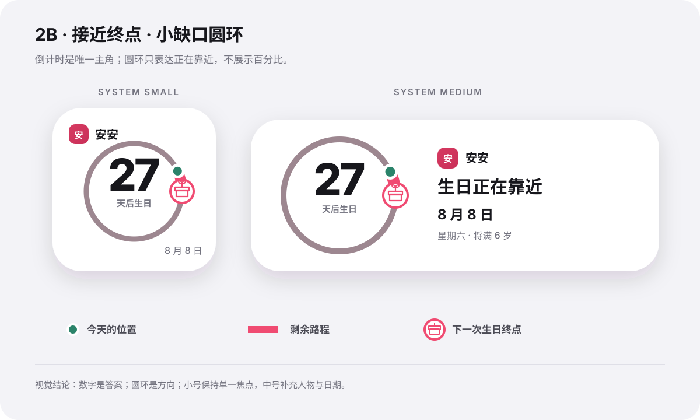

# 单人生日倒计时 Widget 设计

状态：视觉方向已确认，尚未进入 iOS 实施。

确认日期：2026-07-12

## 背景

当前 `UpcomingBirthdaysWidget` 以生日列表和日期摘要为主；选择单个联系人时，也没有把倒计时作为主视觉。`ContactAgeWidget` 则负责展示某个人已经出生多久，并在中号 Widget 中把“距离下次生日还有多少天”作为次要信息。现有年龄 Widget 设计见 [联系人年龄 Widget 设计](./2026-07-05-contact-age-widget-design.md)。

本轮探索决定把现有 `UpcomingBirthdaysWidget` 重定位为以单个人物生日倒计时为核心的展示方向，让用户一眼看到距离下一次生日还有多久。`ContactAgeWidget` 保持现有定位与交互，不属于本轮改造范围。

## 已确认的设计结论

- 生日倒计时是整张 Widget 的唯一主角。
- 采用网页探索中的 **2B「接近终点」**方向。
- 重定位现有 `UpcomingBirthdaysWidget` 的产品入口，不在 Widget gallery 中再增加第三个同类入口。
- 沿用 `UpcomingBirthdaysWidget` 现有的 WidgetKit kind 和 `SelectPersonIntent` 配置，使用户已经添加的该 Widget 原位更新为生日倒计时。
- 原有多人生日列表布局不再作为 `UpcomingBirthdaysWidget` 的主界面；未选择联系人时显示配置空态。
- `ContactAgeWidget` 继续展示已经出生多久，并保留年龄格式切换与已保存的格式偏好。
- 主视觉是接近完整的圆环，只保留一个用于区分起点和生日终点的小缺口。
- 礼物图标表示下一次生日终点。
- 薄荷色圆点表示今天在生日周期中的当前位置。
- 圆点与终点之间的粉色圆弧表示剩余路程。
- 中央文字直接给出剩余时间；圆环只负责表达“正在靠近”，不显示完成百分比。
- 同时支持 `systemSmall` 和 `systemMedium`。

## 产品目标

- 用户无需解释图表，就能在第一眼读到剩余天数。
- 圆环提供时间正在前进、生日正在靠近的感受，但不能与主数字争夺层级。
- 小号 Widget 保持单一焦点；中号 Widget 利用横向空间补充人物和生日上下文。
- 联系人只有生日月日、没有出生年份时，倒计时仍然正常展示。
- 浅色、深色及系统有色渲染下都保持清晰语义。

## 信息层级

从高到低依次为：

1. 剩余时间，例如 `27` 与“天后生日”。
2. 接近完整的生日轨道、当前位置圆点和生日终点。
3. 联系人姓名。
4. 下一次生日日期。
5. 中号 Widget 中的星期，以及联系人有出生年份时的下一年龄。

不得增加百分比、进度说明或另一组同等醒目的年龄数字。

## 视觉语义

### 圆环

- 圆环代表从上一次生日走向下一次生日的周期。
- 圆环接近完整，缺口应足够小，只承担区分起终点的作用；不得回到容易被看成“大半圈”的开放轨道。
- 完整轨道使用低强调色，剩余路程使用生日粉强调色。
- 薄荷色圆点位于剩余路程的起点，表示今天。
- 礼物标记固定在剩余路程的终点，表示下一次生日。
- 圆点位置按“从上一次生日到下一次生日”的实际日历周期计算；经过比例决定圆点位置，剩余比例决定粉色弧长。不得假设所有周期都是 365 天。
- 数字是时间事实的唯一权威表达。圆点位置和弧长虽然按实际周期计算，但只提供方向感，不展示或要求用户读取精确百分比。

### 颜色与材质

- 背景、主要文字和次要文字优先使用系统语义颜色。
- 生日强调色沿用 App 现有粉色语气；当前位置可使用与 App Icon 协调的薄荷色。
- 小组件内部保持平面、克制，不叠加第二层卡片或复杂拟物装饰。
- 深色模式中必须重新保证轨道、粉色剩余段、薄荷圆点和终点图标之间的明度差。
- 颜色不能成为唯一信息载体；圆点和终点必须同时依靠形状区分。

## 尺寸布局

### `systemSmall`

- 姓名与首字母标识位于左上角，姓名限制为单行并在末尾省略。
- 小缺口圆环居中，占据主要视觉区域。
- 剩余时间位于圆环中央。
- 下一次生日日期位于右下角。
- 不显示下一年龄、出生时长、操作提示或百分比。

### `systemMedium`

- 左侧展示圆环和剩余时间，视觉权重与小号保持一致。
- 右侧依次展示联系人、短句“生日正在靠近”、生日日期和星期；联系人有出生年份时再展示下一年龄。
- 联系人缺少出生年份时隐藏下一年龄，但保留倒计时与日期。
- 不把中号简单做成小号的放大版本，也不在右侧重复一遍主倒计时数字。

## 时间状态

| 状态 | 中央主文案 | 辅助文案与图形 |
| --- | --- | --- |
| 生日当天 | `今天` | 显示“生日快乐”；当前位置与生日终点合并，终点获得轻量庆祝强调 |
| 距离 1 天 | `明天` | 显示“生日”；圆点停在终点前的最小可辨距离 |
| 距离 2–99 天 | 数字，例如 `27` | 显示“天后生日” |
| 距离 100 天及以上 | 三位数或更多位，例如 `120` | 只进行必要的光学缩放，不能降低主信息层级 |

网页中的时间与外观切换按钮仅用于评审不同状态，不是未来 Widget 内的产品控件。

## 数据与异常状态

现有 `UpcomingBirthday` 和 `WidgetPersonSnapshot` 已包含联系人姓名、下一次生日日期、快照生成时的距离生日天数和下一年龄，但其中 `daysUntilNextBirthday` 是冻结值，不能直接作为长期显示的实时倒计时。

`UpcomingBirthdaysProvider` 必须针对每个 entry 的日期重新计算主倒计时：

- Provider 创建 Timeline entry 时，`entry.date` 必须是该 entry 的计划展示日期；如果每次午夜后重新加载单个 entry，就使用该次加载的当前日期，如果提前生成多日 entries，就分别使用每个 entry 的计划日期。不得继续把 `snapshot.generatedAt` 当作倒计时计算日期；它只表示快照数据的新鲜度。
- 根据下一次生日日期和 entry 日期计算当天剩余天数，并在本地午夜后刷新。
- 即使用户连续多日没有打开 App，倒计时也要逐日递减。
- 跨过生日当天后，必须按联系人所用日历推进到下一次有效生日，不能继续显示过期日期或停留在 `0`。
- 圆点位置使用上一次生日、下一次生日和 entry 日期所构成的实际周期比例；具体由 Widget 推导还是由 App 写入额外快照字段，留给实施计划决定。
- `daysUntilNextBirthday` 可以作为快照校验或初始值，但不是持续显示的唯一事实来源。

实施时还应遵守以下规则：

- 只有生日月日、缺少出生年份：继续展示倒计时和日期，隐藏下一年龄。
- 没有生日月日：显示简短空态，引导用户补充生日。
- 尚未选择联系人：引导用户配置联系人。
- 所选联系人已删除或不可用：沿用现有“所选联系人已不在列表中”语义。
- 数据读取失败：使用安全空态并按现有 Widget 日志方式记录错误。

## 本地化与可访问性

- 中文状态使用“今天”“明天”“N 天后生日”；其他语言必须使用本地化文案，不拼接固定语序。
- 整张 Widget 提供完整可访问描述，例如：“安安，距离下次生日还有 27 天，生日是 8 月 8 日。”
- 圆环 SVG 或 Shape 属于装饰信息，应从单独的 VoiceOver 焦点中隐藏。
- 姓名视觉上可以省略，但可访问描述必须读取完整姓名。
- 正文对比度至少满足 4.5:1，关键图形边界至少满足 3:1。视觉参考中的色值按此要求选取，但实现仍应使用系统语义色并重新实测。
- Widget 不依赖持续动画解释状态；若实施过渡效果，必须尊重“减弱动态效果”。

## 非目标

- 本轮不实现 iOS 代码。
- 不修改 `ContactAgeWidget` 展示已经出生多久、点按切换年龄格式的现有行为。
- 不在 `UpcomingBirthdaysWidget` 中同时保留多人生日列表和单人生日倒计时两套主界面。
- 不依赖人物照片；现有姓名首字母足以提供身份识别。
- 不展示完成百分比、精确年度进度或复杂日历刻度。
- 不在本轮决定 Widget 点击后的 App 跳转页面。

## 留给实施阶段的技术决策

- 配置展示名、描述和本地化 key 的最终命名。
- WidgetKit 有色渲染和不同设备实际 Widget 尺寸下的最终参数。
- 圆点位置和跨生日后的下一次日期由 Widget 侧按日历推导，还是由 App 预先写入足够的生日周期字段。

## 后续实施验收

- 小号和中号都能在第一眼读到倒计时。
- 生日当天（显示“今天”）、距离 1 天（显示“明天”）、`27`、`120` 和最长合法天数状态均无截断或重叠。
- 长中文姓名和长英文姓名不会改变圆环尺寸或挤压主数字。
- 缺少出生年份时仍能展示倒计时。
- 用户不打开 App 时，倒计时仍会连续多日递减，并能在生日当天后滚动到下一次生日。
- 浅色、深色及系统有色渲染均可辨认当前位置、剩余路程和生日终点。
- VoiceOver 能一次读出联系人、剩余时间和生日日期，不朗读无意义的图形节点。
